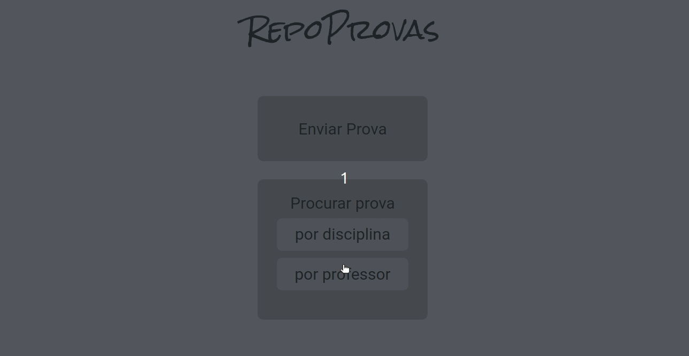

# RepoProvas 📝

</br>

<p align="center">
  
</p>

</br>

## About ❔

RepoProvas is an online exam repository, made for you to share the college exams you have at hand and search for exams from that teacher or class that you need ✌️.

<!-- ## Preview

um gif da aplicação bem maneiro -->

</br>

## Deployment 🚀

<p align="center"><a  href="https://repo-provas-beige.vercel.app/">https://repo-provas-beige.vercel.app/</a></p>

</br>

## Features ✅

- [x] Send a exam by url
- [x] Search for a teacher's exam
- [x] Search for a course's exam

</br>

## How to run 🏃‍♀️💨

```bash
# Clone the API repository
$ git clone https://github.com/victordurco/repo-provas-api

# Access the API project folder cmd/terminal
$ cd repo-provas-api

# Install the dependencies
$ npm i

# Follow de instructions in the API repository to start dev server
 https://github.com/victordurco/repo-provas-api

# Clone this repository in another folder
$ git clone https://github.com/victordurco/repo-provas

# Access the project folder cmd/terminal
$ cd repo-provas

# Install the dependencies
$ npm i

# Compile the code
$ npm run build

# Run the application
$ npm start

# The server will automatically start at localhost:3000/ on your favorite browser
```

</br>

## Tech Stack 💾

<br/>

<p align="center">


</p>

</br>

<!--
### Contributors and Contact

### Acknowledgements -->
